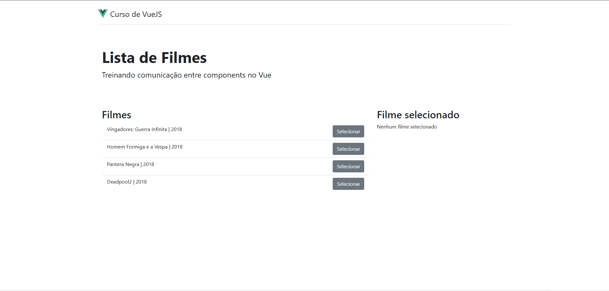
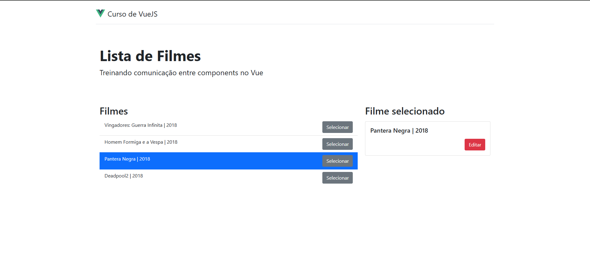
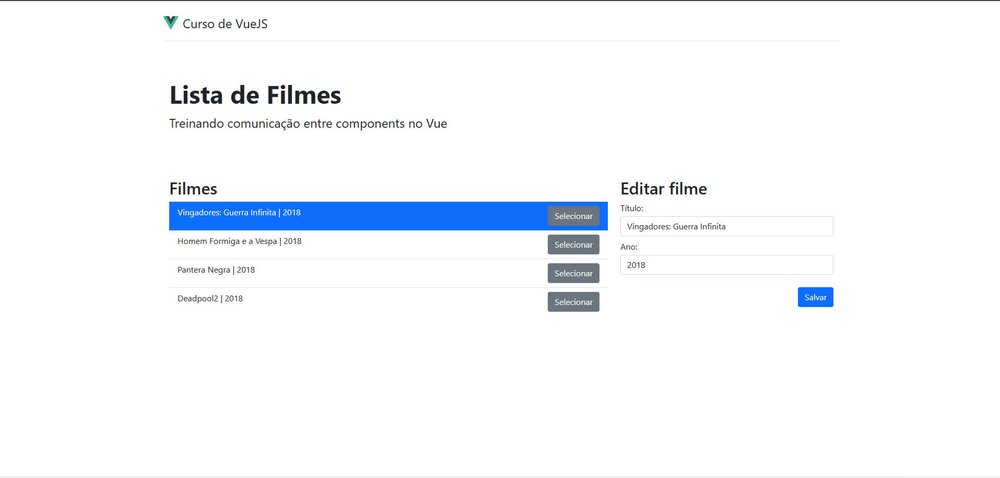

# 🎬 Vue Components - Comunicação entre Componentes

<div align="center">


Uma aplicação educacional que demonstra os padrões de comunicação entre componentes no Vue.js

[Sobre](#-sobre) • [Tecnologias](#-tecnologias) • [Instalação](#-instalação) • [Como Usar](#-como-usar) • [Screenshots](#-screenshots)

</div>

---

## 📋 Sobre

Esta é uma aplicação desenvolvida como parte do **Curso de Vue.js**, focando em ensinar os diferentes padrões de comunicação entre componentes. A aplicação implementa um gerenciador de filmes com funcionalidades de seleção, visualização e edição de dados.

### Principais Características

- ✨ **Props**: Comunicação de dados do componente pai para o filho
- 📡 **Events**: Emissão de eventos customizados
- 🚌 **Event Bus**: Comunicação entre componentes irmãos
- 🔄 **Reatividade**: Dados reativos e atualizações em tempo real
- 🎨 **Interface moderna**: Utiliza Bootstrap 5 para um design responsivo

---

## 🛠️ Tecnologias

| Tecnologia | Versão | Descrição |
|-----------|--------|-----------|
| **Vue.js** | 2.6.14 | Framework progressivo JavaScript |
| **Node.js** | 22.21.1 | Runtime JavaScript |
| **Bootstrap** | 5.1.3 | Framework CSS responsivo |
| **Babel** | 7.12.16 | Transpilador JavaScript |
| **ESLint** | 7.32.0 | Linter de código |

---

## ⚙️ Instalação

### Pré-requisitos

Antes de começar, certifique-se de ter instalado:
- **Node.js** v22.21.1 ou superior
- **npm** (gerenciador de pacotes Node.js)

### Passo a Passo

1. **Clone o repositório**
   ```bash
   git clone https://github.com/marcionavarro/curso-vuejs
   cd 07-vue-components-comunicacao
   ```

2. **Instale as dependências**
   ```bash
   npm install
   ```

3. **Inicie o servidor de desenvolvimento**
   ```bash
   npm run serve
   ```

4. **Acesse a aplicação**
   - A aplicação estará disponível em `http://localhost:8080`
   - O servidor reinicia automaticamente ao fazer alterações no código

---

## 🚀 Como Usar

### Comandos Disponíveis

#### Desenvolvimento
```bash
npm run serve
```
Compila e abre a aplicação em modo de desenvolvimento com hot-reload ativo.

#### Produção
```bash
npm run build
```
Compila e minifica o projeto para produção. Os arquivos otimizados estarão em `/dist`.

#### Linting
```bash
npm run lint
```
Verifica a qualidade do código e corrige problemas de formatação automaticamente.

### Funcionalidades da Aplicação

1. **Listar Filmes**: Visualize uma lista de filmes disponíveis
2. **Selecionar Filme**: Clique no botão "Selecionar" para escolher um filme
3. **Visualizar Detalhes**: Veja as informações do filme selecionado
4. **Editar Filme**: Clique em "Editar" para modificar os dados do filme
5. **Salvar Alterações**: Atualize os dados do filme na lista

---

## 📁 Estrutura do Projeto

```
src/
├── components/
│   ├── FilmesLista.vue              # Componente principal de gerenciamento
│   ├── FilmesListaIten.vue          # Item individual da lista
│   ├── FilmesListaItenInfo.vue      # Informações do filme selecionado
│   └── FilmesListaItenEditar.vue    # Formulário de edição
├── assets/
│   └── vue-logo.svg
├── App.vue                           # Componente raiz
└── main.js                           # Ponto de entrada da aplicação
```

---

## 🎯 Padrões de Comunicação Implementados

### 1. **Props** (Pai → Filho)
```javascript
// Em FilmesListaIten.vue
props: {
  filme: {
    type: Object,
    required: true
  }
}
```

### 2. **Events** (Filho → Pai)
```javascript
// Emitindo evento customizado
this.$emit('editarFilme', this.filme)
```

### 3. **Event Bus** (Comunicação entre Irmãos)
```javascript
// Em main.js
export const eventBus = new Vue({...})

// Usando o Event Bus
eventBus.$on('selecionarFilme', (filme) => {...})
eventBus.selecionarFilme(this.filme)
```

---

## 📸 Screenshots

<!-- Adicione screenshots aqui -->

| Descrição | Screenshot |
|-----------|-----------|
| **Tela Inicial** |  |
| **Filme Selecionado** |  |
| **Modo Edição** |  |

---

## 🔧 Configuração Personalizada

Este projeto utiliza o Vue CLI. Veja a [Referência de Configuração do Vue CLI](https://cli.vuejs.org/config/) para mais informações sobre personalização avançada.

---

## 📝 Licença

Este projeto está sob a licença MIT. Veja o arquivo [LICENSE](LICENSE) para mais detalhes.

---

## 👤 Autor

Desenvolvido como parte do **Curso de Vue JS - Guia Completo (Vue CLI, Vue Router, Vuex e GraphQL)**.

---

## 🤝 Contribuições

Contribuições são bem-vindas! Sinta-se livre para abrir issues e pull requests.

---

<div align="center">

**Feito com 💚 usando Vue.js**

</div>
