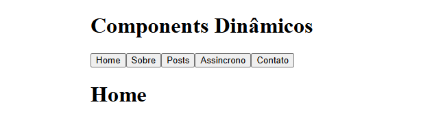
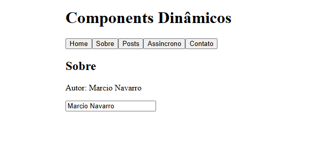
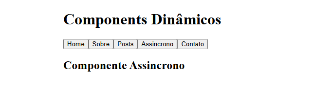

# 🎯 Slots, Componentes Dinâmicos e Componentes Assíncronos

Uma aplicação Vue.js que demonstra o uso avançado de componentes, incluindo slots, componentes dinâmicos e carregamento assíncrono de componentes.

## 📋 Sobre a Aplicação

Este projeto é uma aplicação educacional que explora conceitos avançados do Vue.js 2, focando em:

- **Slots**: Mecanismo poderoso para criar componentes reutilizáveis e flexíveis
- **Componentes Dinâmicos**: Alternância entre componentes em tempo de execução
- **Componentes Assíncronos**: Carregamento sob demanda de componentes

A aplicação possui uma interface intuitiva com navegação entre diferentes páginas e componentes demonstrando essas funcionalidades em ação.

## 🚀 Tecnologias Utilizadas

| Tecnologia | Versão | Descrição |
|------------|--------|-----------|
| **Vue.js** | ^2.6.14 | Framework JavaScript progressivo |
| **Node.js** | 18.x ou superior | Ambiente de execução JavaScript |
| **Babel** | ^7.12.16 | Transpilador JavaScript |
| **Vue CLI** | ~5.0.0 | Ferramenta oficial para criar projetos Vue |
| **ESLint** | ^7.32.0 | Analisador estático de código |

## 📦 Pré-requisitos

Antes de começar, certifique-se de ter instalado:

- **Node.js** versão 18.x ou superior
- **npm** (Node Package Manager) - incluído com Node.js

Para verificar se o Node.js está instalado:

```bash
node --version
npm --version
```

## 🔧 Instalação

### 1. Clonar o Repositório

```bash
git clone https://github.com/marcionavarro
cd 08-slots-components-dinamicos-e-components-assincronos
```

### 2. Instalar Dependências

```bash
npm install
```

Isso irá instalar todas as dependências do projeto conforme especificado no `package.json`.

## 🏃 Como Rodar a Aplicação

### Modo de Desenvolvimento

Para iniciar o servidor de desenvolvimento com hot-reload (recarregar automaticamente ao fazer alterações):

```bash
npm run serve
```

A aplicação estará disponível em: **http://localhost:8080**

### Build para Produção

Para compilar e minificar o projeto para produção:

```bash
npm run build
```

Os arquivos otimizados serão gerados na pasta `dist/`.

### Verificar Qualidade do Código

Para executar o linter e corrigir automaticamente problemas de formatação:

```bash
npm run lint
```

## 📸 Screenshots

_Adicione aqui capturas de tela da aplicação em funcionamento:_

- Interface principal
  

- Demonstração de componentes dinâmicos
  


- Exemplo de uso de slots
  

- Componentes carregados assincronamente



## 📁 Estrutura do Projeto

```
src/
├── components/
│   ├── AssincronoTester.vue      # Componente para testar carregamento assíncrono
│   ├── PageHome.vue              # Página inicial
│   ├── PageSobre.vue             # Página sobre
│   ├── PostListaItem.vue         # Item de lista de posts
│   └── PostsLista.vue            # Lista de posts
├── assets/                        # Arquivos estáticos (imagens, etc.)
├── App.vue                        # Componente raiz
└── main.js                        # Arquivo de entrada
```

## 🎓 Conceitos Principais

### Slots
Os slots permitem que você passe conteúdo de um componente pai para um componente filho, criando componentes mais flexíveis e reutilizáveis.

### Componentes Dinâmicos
Permite alternar entre diferentes componentes dinamicamente usando a propriedade `:is`.

### Componentes Assíncronos
Carrega componentes sob demanda, melhorando o desempenho da aplicação ao dividir o bundle.

## 🛠️ Configuração Personalizada

Para mais informações sobre configuração do Vue CLI, consulte:
- [Vue CLI Configuration Reference](https://cli.vuejs.org/config/)
- [Vue.js Official Documentation](https://vuejs.org/)

## 📝 Scripts Disponíveis

| Comando | Descrição |
|---------|-----------|
| `npm run serve` | Inicia servidor de desenvolvimento com hot-reload |
| `npm run build` | Cria build otimizada para produção |
| `npm run lint` | Executa linter e corrige problemas de formatação |

## 💡 Dicas de Desenvolvimento

- Use `npm run serve` durante o desenvolvimento para aproveitar o hot-reload
- Consulte a documentação oficial do Vue.js para mais exemplos
- Verifique o código dos componentes para entender as implementações

## 📚 Recursos Úteis

- [Documentação oficial do Vue.js 2](https://v2.vuejs.org/)
- [Vue CLI Documentation](https://cli.vuejs.org/)
- [Babel Documentation](https://babeljs.io/)

## 📄 Licença

Este projeto é parte de um curso educacional sobre Vue.js.

---

**Desenvolvido com 💚 durante o curso de Vue JS - Guia Completo (Vue CLI, Vue Router, Vuex e GraphQL)**
