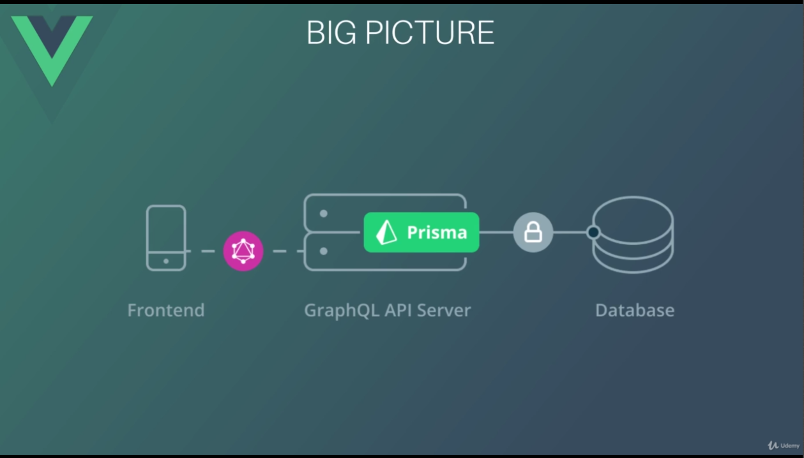

# Introdução ao Projeto

## Visão Geral

### Gerenciador de Finanças Pessoais

- Criar conta (para se autentica)
- Criar Lançamentos (Receita ou Despesa)
- Criar Contas (ex: Cartão de Crédito, Dinheiro)
- Criar Categorias
- Listar Lançamentos por mês
- Filtrar Lançamentos
- Visualizar saldo total no dia
- Visualizar saldo do mês
- Visulaizar relatório do mês (via Gráfico)

## Back-End

- API GraphQL (Node JS)
- Prisma IO (Server e Client);: substitui os ORM's tradicionais,  
DAL(Data Access Layer)
- GraphQL Yoga: Servidor GraphQL completo com foco em   
fácil configuração, desempenho e excelente experiência do  
desenvolvedor
- Autenticação JWT: JSON Web Tokens e bcrypt para  
criptografia de senhas
- Moment JS: Manipular Datas

## Front-End

- Vue
- Vue Router
- Vuex
- Vuetify: Components de Interface
- Vuelidate: Validação de Formulários
- Apollo Client (via Apollo Boost): Integração com a API GraphQL
- Chart JS: Gráficos

## Big Picture

### 6. Prisma CLI Novo serviço para se conectar ao Prisma Server

#### Instalando o prisma 
`npm i -g prisma@1.28`  

#### Criar um serviço
`prisma init --endpoint http://localhost:4466`

#### Rodar um deploy
`prisma deploy`

#### Rodar um generate
`prisma generate`

### Comandos docker
`docker composer up -d`  
`sudo systemctl stop docker.socket`

